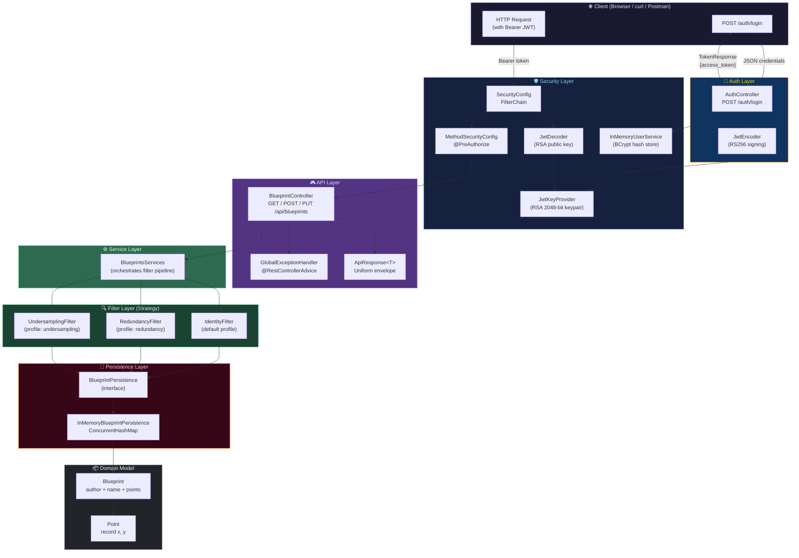
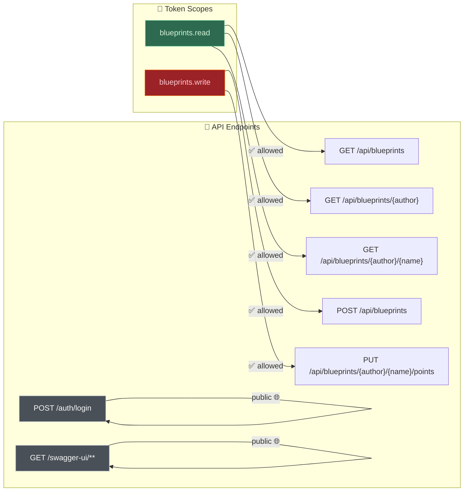
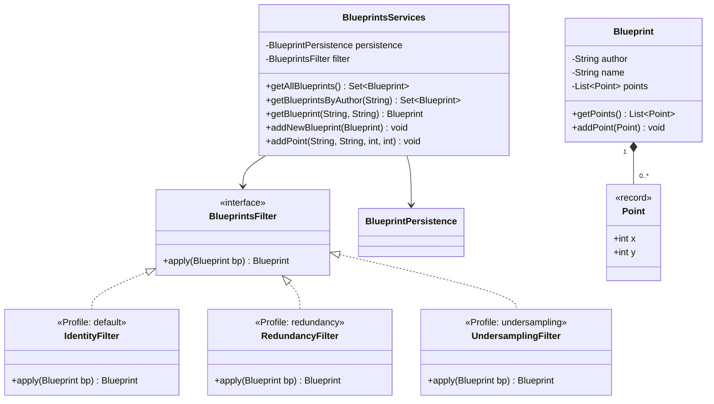

# 🏛️ Escuela Colombiana de Ingeniería Julio Garavito
## ⚙️ Software Architecture – ARSW
### 🔐 Lab – Part 2: BluePrints API with JWT Security (OAuth 2.0 Resource Server)


> This lab extends **Part 1** ([Lab_P1_BluePrints_Java21_API](https://github.com/TerraFour-ECI/arsw-blueprints-api-lab)) by adding **API security** using **Spring Boot 3, Java 21, and JWT (OAuth 2.0 RS256)**.
> The API becomes a **Resource Server** protected by Bearer tokens signed with RSA-256.
> It includes a didactic `/auth/login` endpoint that issues tokens to facilitate testing.

---

## 📋 Table of Contents

1. [Objectives](#-objectives)
2. [Requirements](#-requirements)
3. [Project Structure](#️-project-structure)
4. [Architecture Diagrams](#-architecture-diagrams)
5. [Running the Project](#-running-the-project)
6. [Security Design](#-security-design)
7. [API Reference](#-api-reference)
8. [Point Filters (Strategy Pattern)](#-point-filters-strategy-pattern)
9. [Testing](#-testing)
10. [Swagger / OpenAPI](#-swagger--openapi)
11. [Lab Activities](#-lab-activities)
12. [Recommended Reading](#-recommended-reading)
13. [Evidence Screenshots](#-evidence-screenshots)

---

## 🎯 Objectives

- Implement **OAuth 2.0 Resource Server** security in REST services using Spring Security 6.
- Configure **JWT issuance** (RS256) and **validation** via a locally generated RSA key pair.
- Protect endpoints with **granular scopes** (`blueprints.read`, `blueprints.write`).
- Apply **method-level security** with `@PreAuthorize` on top of URL-level authorization.
- Integrate **Swagger UI** with Bearer token authentication.
- Port the **full business domain** (models, persistence, filters, services) from Part 1 into the secured context.

---

## ✅ Requirements

| Requirement | Version |
|-------------|---------|
| JDK | 21+ |
| Maven | 3.9+ |
| Git | Any recent |

---

## 🗂️ Project Structure

```
src/main/java/co/edu/eci/blueprints/
  ├── BlueprintsApiApplication.java        # Spring Boot entry point
  │
  ├── model/
  │    ├── Blueprint.java                  # Domain entity (author + name + points)
  │    └── Point.java                      # Immutable 2D coordinate (record)
  │
  ├── persistence/
  │    ├── BlueprintPersistence.java        # Storage contract (interface)
  │    ├── InMemoryBlueprintPersistence.java# Thread-safe ConcurrentHashMap impl
  │    ├── BlueprintNotFoundException.java  # Checked exception – 404
  │    └── BlueprintPersistenceException.java# Checked exception – 409
  │
  ├── filters/
  │    ├── BlueprintsFilter.java           # Strategy interface
  │    ├── IdentityFilter.java             # Default: no transformation
  │    ├── RedundancyFilter.java           # Removes consecutive duplicates
  │    └── UndersamplingFilter.java        # Keeps every other point
  │
  ├── services/
  │    └── BlueprintsServices.java         # Orchestration + filter pipeline
  │
  ├── api/
  │    ├── BlueprintController.java        # Protected REST endpoints (/api/blueprints)
  │    ├── GlobalExceptionHandler.java     # @RestControllerAdvice (400/500, re-throws 401/403)
  │    └── dto/
  │         └── ApiResponse.java           # Generic uniform response record
  │
  ├── auth/
  │    └── AuthController.java             # Didactic login → issues JWT (/auth/login)
  │
  ├── config/
  │    └── OpenApiConfig.java              # Swagger + Bearer JWT security scheme
  │
  └── security/
       ├── SecurityConfig.java             # Filter chain + JwtDecoder/Encoder beans
       ├── MethodSecurityConfig.java       # Enables @PreAuthorize (@EnableMethodSecurity)
       ├── JwtKeyProvider.java             # RSA 2048-bit key pair (generated at startup)
       ├── InMemoryUserService.java        # Hardcoded user store (BCrypt hashes)
       └── RsaKeyProperties.java           # @ConfigurationProperties: issuer + TTL

src/main/resources/
  └── application.yml                      # Server port, JWT settings (issuer, TTL)
```

---

## 🏗️ Architecture Diagrams

### 1. Layered Architecture Overview

The following diagram shows all layers and their dependencies from HTTP request to in-memory storage:



---

### 2. JWT Authentication Flow

```mermaid
sequenceDiagram
    actor Client
    participant AuthCtrl as AuthController<br/>/auth/login
    participant UserSvc as InMemoryUserService
    participant JwtEnc as JwtEncoder<br/>(RS256)
    participant KeyProv as JwtKeyProvider<br/>(RSA Keypair)
    participant BpCtrl as BlueprintController<br/>/api/blueprints
    participant JwtDec as JwtDecoder<br/>(RSA pub key)
    participant Security as Spring Security<br/>(MethodSecurity)
    participant Services as BlueprintsServices

    Note over Client,Services: ── STEP 1: Obtain Token ──────────────────────────────────

    Client->>AuthCtrl: POST /auth/login<br/>{"username":"student","password":"student123"}
    AuthCtrl->>UserSvc: isValid(username, rawPassword)
    UserSvc->>UserSvc: BCrypt.matches(rawPassword, storedHash)
    UserSvc-->>AuthCtrl: true ✅

    AuthCtrl->>JwtEnc: encode(JwtClaimsSet{sub, scope, iat, exp})
    JwtEnc->>KeyProv: privateKey()
    KeyProv-->>JwtEnc: RSAPrivateKey
    JwtEnc-->>AuthCtrl: signed JWT (RS256)

    AuthCtrl-->>Client: 200 OK<br/>{"access_token":"eyJ...", "token_type":"Bearer", "expires_in":3600}

    Note over Client,Services: ── STEP 2: Access Protected Resource ─────────────────────

    Client->>BpCtrl: GET /api/blueprints<br/>Authorization: Bearer eyJ...
    BpCtrl->>JwtDec: decode(token)
    JwtDec->>KeyProv: publicKey()
    KeyProv-->>JwtDec: RSAPublicKey
    JwtDec->>JwtDec: Verify signature, exp, iss
    JwtDec-->>BpCtrl: JwtAuthenticationToken{scope:blueprints.read, blueprints.write}

    BpCtrl->>Security: @PreAuthorize("hasAuthority('SCOPE_blueprints.read')")
    Security-->>BpCtrl: ✅ Authorized

    BpCtrl->>Services: getAllBlueprints()
    Services-->>BpCtrl: Set&lt;Blueprint&gt;
    BpCtrl-->>Client: 200 OK ApiResponse{code:200, data:[...]}

    Note over Client,Services: ── STEP 3: Insufficient Scope ─────────────────────────────

    Client->>BpCtrl: POST /api/blueprints (only blueprints.read scope)
    BpCtrl->>Security: @PreAuthorize("hasAuthority('SCOPE_blueprints.write')")
    Security-->>BpCtrl: ❌ AccessDeniedException
    BpCtrl-->>Client: 403 Forbidden
```

---

### 3. Scope-Based Access Control Matrix



---

### 4. Filter Strategy Pattern



---

## 🚀 Running the Project

### 1. Clone the repository

```bash
git clone https://github.com/DECSIS-ECI/Lab_P2_BluePrints_Java21_API_Security_JWT.git
cd Lab_P2_BluePrints_Java21_API_Security_JWT
```

### 2. Run with Maven (default profile — IdentityFilter)

```bash
mvn spring-boot:run
```

### 3. Run with a specific filter profile

```bash
# Redundancy filter (removes consecutive duplicate points)
mvn spring-boot:run "-Dspring-boot.run.profiles=redundancy"

# Undersampling filter (keeps 1 out of every 2 points)
mvn spring-boot:run "-Dspring-boot.run.profiles=undersampling"
```

### 4. Verify startup

The application starts at `http://localhost:8080`.

```
  .   ____          _            __ _ _
 /\\ / ___'_ __ _ _(_)_ __  __ _ \ \ \ \
( ( )\___ | '_ | '_| | '_ \/ _` | \ \ \ \
 \\/  ___)| |_)| | | | | || (_| |  ) ) ) )
  '  |____| .__|_| |_|_| |_\__, | / / / /
 =========|_|==============|___/=/_/_/_/
 :: Spring Boot ::                (v3.3.2)
```

---

## 🛡️ Security Design

### How It Works

| Component | Responsibility |
|-----------|----------------|
| `JwtKeyProvider` | Generates a fresh **RSA 2048-bit** key pair at application startup |
| `SecurityConfig` | Configures the filter chain, whitelists `/auth/login` and Swagger, protects `/api/**` |
| `MethodSecurityConfig` | Enables `@PreAuthorize` method-level annotations |
| `AuthController` | Validates credentials against `InMemoryUserService`, signs a JWT with RS256 |
| `JwtDecoder` bean | Validates incoming Bearer tokens using the RSA public key |
| `InMemoryUserService` | Stores username → BCrypt-hashed-password pairs |

### Scopes

| Scope | Required For |
|-------|-------------|
| `blueprints.read` | All `GET` endpoints |
| `blueprints.write` | `POST` (create blueprint), `PUT` (add point) |

> **Note:** Every issued token includes **both** scopes (`blueprints.read blueprints.write`) by default.
> This design is intentional for the educational context — extend the `AuthController` to issue separate tokens per role if needed.

### Security Configuration Highlights

```java
// URL-level: /api/** requires any valid scope
.requestMatchers("/api/**").hasAnyAuthority("SCOPE_blueprints.read", "SCOPE_blueprints.write")

// Method-level: each endpoint enforces its specific scope
@PreAuthorize("hasAuthority('SCOPE_blueprints.read')")   // GET endpoints
@PreAuthorize("hasAuthority('SCOPE_blueprints.write')")  // POST / PUT endpoints
```

### Predefined Users

| Username | Password | Scopes (issued) |
|----------|----------|-----------------|
| `student` | `student123` | `blueprints.read blueprints.write` |
| `assistant` | `assistant123` | `blueprints.read blueprints.write` |

---

## 📡 API Reference

### 🔑 1. Login — obtain a JWT

```http
POST http://localhost:8080/auth/login
Content-Type: application/json

{
  "username": "student",
  "password": "student123"
}
```

**Response `200 OK`:**
```json
{
  "access_token": "eyJhbGciOiJSUzI1NiJ9...",
  "token_type": "Bearer",
  "expires_in": 3600
}
```

**Response `401 Unauthorized` (wrong credentials):**
```json
{
  "error": "invalid_credentials"
}
```

---

### 📋 2. List all blueprints `[blueprints.read]`

```http
GET http://localhost:8080/api/blueprints
Authorization: Bearer <ACCESS_TOKEN>
```

**Response `200 OK`:**
```json
{
  "code": 200,
  "message": "execute ok",
  "data": [
    { "author": "john", "name": "house",  "points": [{"x":0,"y":0}, ...] },
    { "author": "john", "name": "garage", "points": [...] },
    { "author": "jane", "name": "garden", "points": [...] }
  ]
}
```

---

### 👤 3. Blueprints by author `[blueprints.read]`

```http
GET http://localhost:8080/api/blueprints/{author}
Authorization: Bearer <ACCESS_TOKEN>
```

**Response `200 OK`** — array of blueprints for `{author}`.  
**Response `404 Not Found`** — no blueprints for that author.

---

### 🔎 4. Specific blueprint `[blueprints.read]`

```http
GET http://localhost:8080/api/blueprints/{author}/{bpname}
Authorization: Bearer <ACCESS_TOKEN>
```

**Response `200 OK`:**
```json
{
  "code": 200,
  "message": "execute ok",
  "data": {
    "author": "john",
    "name": "house",
    "points": [
      {"x": 0,  "y": 0 },
      {"x": 10, "y": 0 },
      {"x": 10, "y": 10},
      {"x": 0,  "y": 10}
    ]
  }
}
```

---

### ➕ 5. Create a blueprint `[blueprints.write]`

```http
POST http://localhost:8080/api/blueprints
Authorization: Bearer <ACCESS_TOKEN>
Content-Type: application/json

{
  "author": "alice",
  "name": "office",
  "points": [
    {"x": 0, "y": 0},
    {"x": 50, "y": 0},
    {"x": 50, "y": 50}
  ]
}
```

**Response `201 Created`** — blueprint stored.  
**Response `409 Conflict`** — blueprint already exists.  
**Response `400 Bad Request`** — missing/blank `author` or `name`.

---

### 📌 6. Add a point to a blueprint `[blueprints.write]`

```http
PUT http://localhost:8080/api/blueprints/{author}/{bpname}/points
Authorization: Bearer <ACCESS_TOKEN>
Content-Type: application/json

{"x": 25, "y": 25}
```

**Response `202 Accepted`:**
```json
{
  "code": 202,
  "message": "point added",
  "data": null
}
```

---

### Status Code Summary

| Scenario | HTTP Code | Endpoint |
|----------|-----------|----------|
| Successful read | `200 OK` | All GET endpoints |
| Blueprint created | `201 Created` | `POST /api/blueprints` |
| Point added | `202 Accepted` | `PUT .../points` |
| Validation error | `400 Bad Request` | `POST /api/blueprints` |
| Unauthenticated | `401 Unauthorized` | Any `/api/**` without JWT |
| Insufficient scope | `403 Forbidden` | Write scope needed on GET-only token |
| Resource not found | `404 Not Found` | GET/PUT with unknown author/name |
| Duplicate blueprint | `409 Conflict` | `POST /api/blueprints` (already exists) |

---

## 🔍 Point Filters (Strategy Pattern)

The filter applied to blueprint retrieval is swapped via **Spring profiles** — no code changes needed:

| Profile | Filter | Behavior |
|---------|--------|----------|
| *(none / default)* | `IdentityFilter` | Returns blueprint unchanged |
| `redundancy` | `RedundancyFilter` | Removes consecutive duplicate points |
| `undersampling` | `UndersamplingFilter` | Keeps only even-indexed points (1 of 2) |

```bash
# Identity (default)
mvn spring-boot:run

# Redundancy
mvn spring-boot:run "-Dspring-boot.run.profiles=redundancy"

# Undersampling
mvn spring-boot:run "-Dspring-boot.run.profiles=undersampling"
```

---

## 🧪 Testing

### Running all tests

```bash
mvn test
```

Expected output:
```
[INFO] Tests run: 32, Failures: 0, Errors: 0, Skipped: 0
[INFO] BUILD SUCCESS
```

### Test Matrix

| Test Class | Tests | What It Covers |
|------------|-------|----------------|
| `BlueprintsApiApplicationTests` | 1 | Spring context loads cleanly |
| `BlueprintServiceTests` | 9 | CRUD operations, error propagation, duplicate detection |
| `FilterTests` | 5 | Identity, Redundancy, Undersampling filter logic |
| `AuthControllerTests` | 3 | Login: valid credentials, wrong password, unknown user |
| `BlueprintControllerTests` | 14 | Full CRUD via MockMvc with JWT mocks; 401/403/404/409 scenarios; end-to-end auth flow |

### Key Testing Techniques

**Mocking JWT scopes (no real token needed):**
```java
import static org.springframework.security.test.web.servlet.request.SecurityMockMvcRequestPostProcessors.jwt;

mockMvc.perform(get("/api/blueprints")
    .with(jwt().authorities(new SimpleGrantedAuthority("SCOPE_blueprints.read"))))
    .andExpect(status().isOk());
```

**End-to-end auth flow (real JWT):**
```java
// 1. Login and extract the real token
String token = /* call /auth/login and parse access_token */;

// 2. Use the real token
mockMvc.perform(get("/api/blueprints")
    .header("Authorization", "Bearer " + token))
    .andExpect(status().isOk());
```

---

## 📚 Swagger / OpenAPI

### Accessing Swagger UI

| URL | Description |
|-----|-------------|
| [http://localhost:8080/swagger-ui/index.html](http://localhost:8080/swagger-ui/index.html) | Interactive API documentation |
| [http://localhost:8080/v3/api-docs](http://localhost:8080/v3/api-docs) | OpenAPI 3 JSON spec |

### Authenticating in Swagger UI

1. Start the application and open the Swagger UI.
2. Click the green **Authorize** 🔒 button at the top right.
3. Call `POST /auth/login` from the Swagger UI itself to get a token.
4. Copy the `access_token` value and paste it into the Authorize dialog:
   ```
   Bearer eyJhbGciOiJSUzI1NiJ9...
   ```
5. All subsequent requests in the UI will include the `Authorization: Bearer` header.

---

## 📖 Lab Activities

1. **Review `SecurityConfig`** — identify how public endpoints (`/auth/login`, Swagger) are separated from protected ones (`/api/**`).
2. **Explore the login flow** — decode the issued JWT at [jwt.io](https://jwt.io) and identify the `sub`, `scope`, `iss`, `iat`, and `exp` claims.
3. **Scope enforcement** — modify `AuthController` to issue tokens with only `blueprints.read` and observe that `POST /api/blueprints` returns `403`.
4. **Token expiration** — change `token-ttl-seconds` in `application.yml` to `10`, obtain a token, wait 11 seconds, and observe `401 Unauthorized`.
5. **Extend the API** — add a `DELETE /api/blueprints/{author}/{bpname}` endpoint protected by a new scope `blueprints.admin`, and update the token issuance to include it.
6. **Profile-based filtering** — run with `--spring.profiles.active=redundancy` and verify that blueprints with duplicate consecutive points have them removed transparently.

---

## 📚 Recommended Reading

- [Spring Security Reference – OAuth2 Resource Server](https://docs.spring.io/spring-security/reference/servlet/oauth2/resource-server/index.html)
- [Spring Security – Method Security](https://docs.spring.io/spring-security/reference/servlet/authorization/method-security.html)
- [JSON Web Tokens Introduction – jwt.io](https://jwt.io/introduction)
- [Spring Boot – Securing Web Applications](https://spring.io/guides/gs/securing-web/)
- [Nimbus JOSE+JWT](https://connect2id.com/products/nimbus-jose-jwt)

---

## 📸 Evidence Screenshots

> **Recommended screenshots to document lab completion:**

### 1. Application Startup
Capture the terminal showing Spring Boot startup logs — look for:
- `Tomcat initialized with port 8080`
- `Started BlueprintsApiApplicationTests` (from test run)
- `[INFO] Tests run: 32, Failures: 0, Errors: 0, Skipped: 0`

### 2. Login — Obtain JWT Token
- **Tool:** Postman, curl, or Swagger UI
- **Request:** `POST /auth/login` with valid credentials
- **Evidence:** Show the full response with `access_token`, `token_type`, `expires_in`
- **Bonus:** Paste the token into [jwt.io](https://jwt.io) and show the decoded payload

### 3. JWT Decoded Payload
Capture [jwt.io](https://jwt.io) showing the decoded claims:
```json
{
  "iss": "https://decsis-eci/blueprints",
  "sub": "student",
  "scope": "blueprints.read blueprints.write",
  "iat": 1710000000,
  "exp": 1710003600
}
```

### 4. Protected GET Endpoint — Success (200)
- `GET /api/blueprints` with valid `Authorization: Bearer <token>`
- Show the full `ApiResponse` JSON with the blueprint array

### 5. Protected GET Endpoint — Unauthorized (401)
- `GET /api/blueprints` **without** the `Authorization` header
- Show the `401 Unauthorized` response

### 6. Protected POST Endpoint — Success (201)
- `POST /api/blueprints` with write scope token and valid body
- Show the `201 Created` response with the created blueprint

### 7. Forbidden Access (403)
- Show a request to `POST /api/blueprints` with a reader-only token (if you modified `AuthController`)
- OR show the Swagger UI endpoint returning `403`

### 8. Swagger UI — Authorize Dialog
- Screenshot of the Swagger UI at `/swagger-ui/index.html`
- Show the **Authorize** button and the Bearer token input field

### 9. Swagger UI — Executing a Secured Endpoint
- Execute any endpoint from Swagger UI after authorizing
- Show the request headers including `Authorization: Bearer ...`
- Show the successful response

### 10. All Tests Passing
- Run `mvn test` and capture the final summary:
  ```
  [INFO] Tests run: 32, Failures: 0, Errors: 0, Skipped: 0
  [INFO] BUILD SUCCESS
  ```

---

## 📜 License

Educational project for academic purposes — Escuela Colombiana de Ingeniería Julio Garavito.

